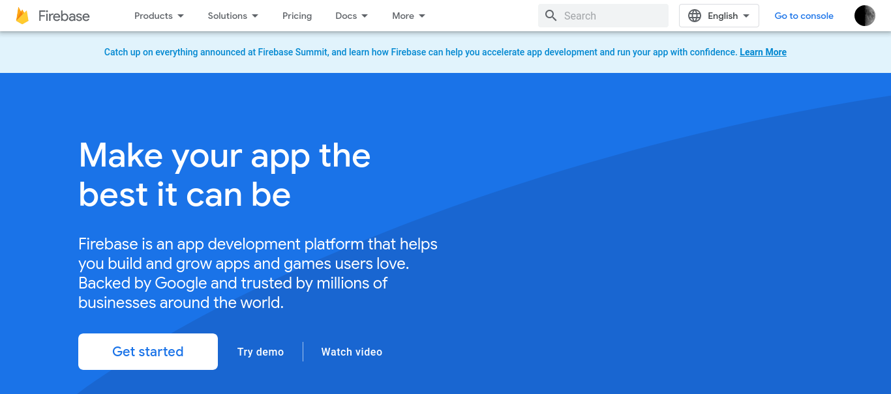

# Crear y preparar el proyecto de Firebase

## Requisitos

- Una cuenta de Google
- Una cuenta de Facebook
- Una cuenta de Expo

## 1. Crear proyecto de Firebase 

### 1.1 Ir a la [consola de Firebase](https://firebase.google.com/), y dar clic en **Comenzar**

### 1.2 Agregar un proyecto

### 1.3 Llenar datos del proyecto

Elegir cualquier nombre para el proyecto y aceptar los ofrecimientos de los próximos pasos.

### 1.4 Agregar una App Web al proyecto

### 1.5 Llenar datos de la App Web

Elegir cualquier sobrenombre para la App Web y dejar deshabilitada la opción de **Firebase Hosting**. Dar clic en **Registrar App**.

### 1.6 Obtener valores de configuración de Firebase

En el código de ejemplo que ofrece Firebase, copiar los valores de la constante `firebaseConfig`:

### 1.7 Copiar valores al archivo `.env`

Insertar los valores de `firebaseConfig` en la sección **Firebase App** del archivo `.env`:

Guardar los cambios al archivo `.env`

## 2. Añadir Firestore al proyecto de Firebase

### 2.1 Añadir Firestore

En la consola de Firebase, ir a **Compilación** > **Firestore Database**.

Dar clic en **Crear base de datos**

En el primer paso, elegir **Comenzar en modo de prueba**.

En el segundo paso, elegir la región más cercana disponible.

Dar clic en **Habilitar**.

### 2.2 Añadir índice para colección de equipos

Para que las consultas paginadas de equipos funcionen, es necesario crear un índice.

Ir a la pestaña **Índices** y presionar **Crear índice**.

Ingresar **teams** en la id de la colección.

En el apartado de campos que se indexarán, inglesar **user** y **name**.

En alcances de las consultas, seleccionar **Colección**.

Presionar **Crear índice**.

## 3 Añadir autenticación con Google al proyecto de Firebase

### 3.1 Añadir autenticación

De vuelta en la consola de Firebase, ir a **Compilación** > **Authentication**

### 3.2 Dar clic en **Comenzar**

### 3.3 Ir al proveedor **Google**

### 3.4 Habilitar proveedor

Elegir cualquier nombre público para el proyecto y el correo electrónico de la cuenta con la que se ha creado el proyecto. Dar clic en **Guardar**.

### 3.5 Configurar el cliente de OAuth2

Ir a las [credenciales de Google Cloud](https://console.cloud.google.com/apis/credentials). Asegurarse de que el proyecto creado está seleccionado en la esquina superior izquierda. Bajo **ID de Clientes OAuth 2.0**, ingresa al cliente web generado por Firebase.

Añadir **https://auth.expo.io** a los orígenes autorizados de JavaScript.

En los URI de redireccionamiento autorizados, añadir **https://auth.expo.io/@usuario/poke-teams-app** reemplazando **usuario** por el nombre de usuario de Expo.

Dar clic en **Guardar**.

### 3.6 Copiar la ID del cliente de OAuth2 al archivo `.env`

De vuelva en el listado de credenciales, copiar la **ID de cliente**.

Insertar la ID de cliente en el archivo `.env`:

Guardar los cambios al archivo `.env`.

## 4 Añadir autenticación con Facebook al proyecto de Firebase

### 4.1 Crear una Facebook App

Autenticarse en la [plataforma de desarrolladores de Facebook](https://developers.facebook.com/apps/). Dar clic en el botón **Create App** del listado de aplicaciones.

En la sección **Type**, elegir **Business**. Presionar **Next**.

En la sección **Details**, elegir **poke-teams-app** para el nombre. Presionar **Create App**.

### 4.2 Configurar Facebook Login

En el dashboard de la App, buscar la tarjeta de **Facebook Login** y dar clic en el botón **Set Up**.

Ignorar la elección de plataforma. Navegar directamente a **Facebook Login** > **Settings** en la barra lateral.

En **Valid OAuth2 Redirect URIs**, añadir **https://auth.expo.io/@usuario/poke-teams-app** reemplazando **usuario** por el nombre de usuario de Expo.

Dar clic en **Save Changes**.

### 4.4 Añadir la Facebook App ID al archivo `.env`

Copiar la **App ID** en el encabezado de la plataforma de desarrolladores de Facebook. Dar click la copiará al portapapeles automáticamente.

Insertar la App ID en el archivo `.env`:

Guardar los cambios al archivo `.env`.

### 4.5 Obtener el App Secret

En la plataforma de desarrolladores de Facebook, ir a **Settings** > **Basic**.

Localizar el campo **App Secret** y dar clic en el botón **Show**.

Copiar el valor de **App Secret**.

### 4.3 Añadir el proveedor **Facebook** a Firebase Authentication

De vuelta en la consola de Firebase, dar click en **Agregar proveedor nuevo** y seleccionar **Facebook**.

### 4.4 Habilitar proveedor

Ingresar la **App ID** en el primer campo y la **App Secret** en el segundo campo.

El tercer campo (deshabilitado) contendrá una URI de redireccionamiento. 

Copiar la URI de redireccionamiento. Después, presionar **Guardar**.

### 4.5 Añadir la URI de redireccionamiento a la Facebook App

De vuelta en la plataforma para desarrolladores de Facebook, ir a **Facebook Login for Gaming** > **Settings**.

Añadir la URI de redireccionamiento en el campo **Valid OAuth Redirect URIs** y guardar cambios.

